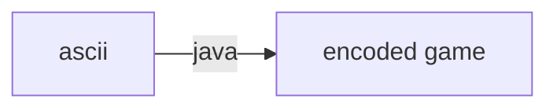
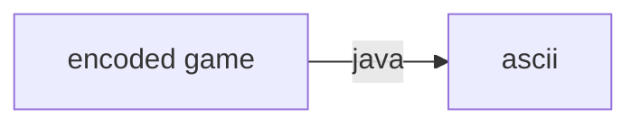

# Ideen
- Workout Tracker
- TV Show tracker
- ASCII Paint
- ASCII Map editor and game

# ASCII Map editor and game

## Concept

### Editor


```
  o
    o
      o  o o
       o o
```

- `o` = coin
- `./game upload file.txt`

### Game



- Player can move left, right, and falls constantly
- Renders line of player-1 and ~5 lines more

- `./game play name`
- `./game list`

## Tables

- Maps(name)

## Encoding

### What needs to be stored?
- x and y values of coins

### How to read it?
- y=line number
- x=char number

### How to store it?
- Coin(x, y, map)

## Decoding

- for every line, if `SELECT * FROM Coin WHERE map=? AND y=?` yields a result, print `o` at `Coin.x`.
- Alternatively, cache coins `SELECT * FROM Coin WHERE map=?`.

## Game

### Event loop

- Every tick, call render, clearing the screen and printing the new frame

### Render

- Keep track of player's x and y position in memory
- First rendered line is reserved for player, python: `" " * x-1 + "V"`
- print lines $[y+1; y+5]$ similarly to player line

### Logic

- if exists coin with position equals player position, increment score
- Only print score to keep it simple
- every tick, increase player's y position


