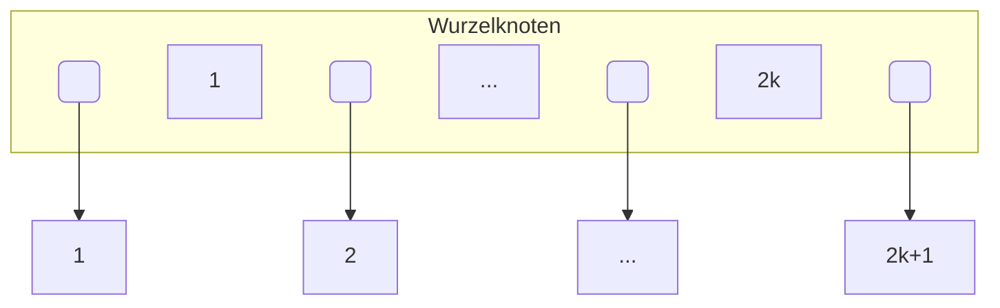

# B-Baum

- Daten stecken im ganzen Baum
- Sortierte Ausgabe: Links-Links-hoch-Rechts-Links-...
	- B+-Baum einfach Blätter nach rechts
- Jeder Knoten Max Grad 2k+1
	- Max 2k+1 Kindknoten
- Jeder Knoten hat zwischen k und 2k Einträge
	- (Wurzel nur mindestens 1 Eintrag)




- Kanten links kleiner, rechts größer und wie gut das betrieb
- Suche:

```
n = Gesuchter Schlüssel
k = Wurzelknoten

n < k: k = k.left_child
n > k: k = k.right_child
n = k: return k
```

- k wird folgendermaßen gewählt:
	- Pointer zum Kindknoten belegt l byte
	- Pointer zu Datensätzen belegen m byte
	- Wegweiser belegt n byte
	- Es gibt 2k knoten
	- $\text{Bytes} = (l+m+n) \cdot (2k)$
	- z.B. $l=4, m=4, n=20, k=50$
		- $100 \cdot (4+20+4)+4=2404\text{B}$
		- k richtet sich danach, ob die Bytes in eine Page passt
		- keine Ahnung woher +4 kommt
- Insert und Delete bei B-Bäumen behandeln wir nicht

# B+-Baum

- Innere Knoten: Nicht-Blatt-Knoten
- Blatt-Knoten: Ganz unten
- In Praxis: $k > k^*$
- $k \le N \le 2k$ (N: Anzahl Einträge in einem inneren Knoten)
- $0 \le M \le 2k+1$ (M: Anzahl Kinderknoten eines inneren Knotens)
- $k^* \le N_B \le 2k^*$ ($N_B$: Anzahl Einträge in einem Blattknoten)
- 