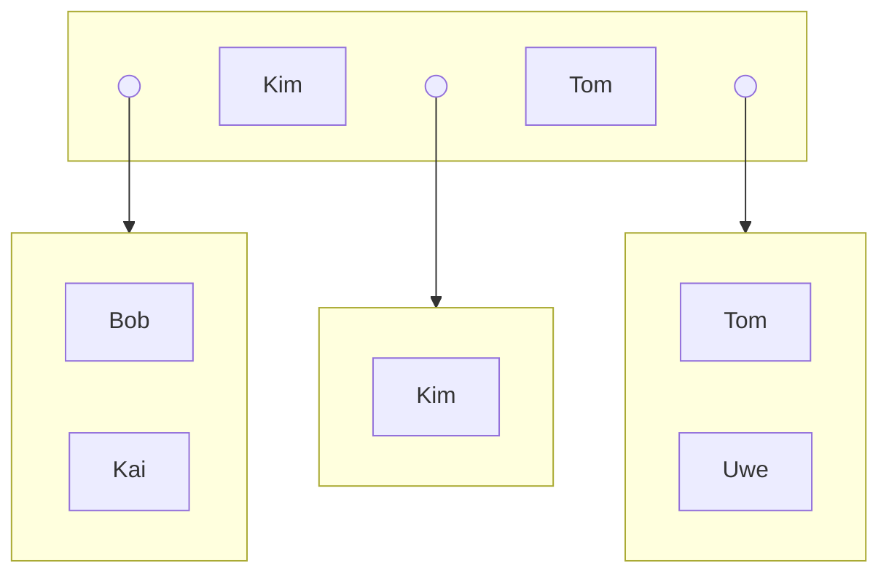
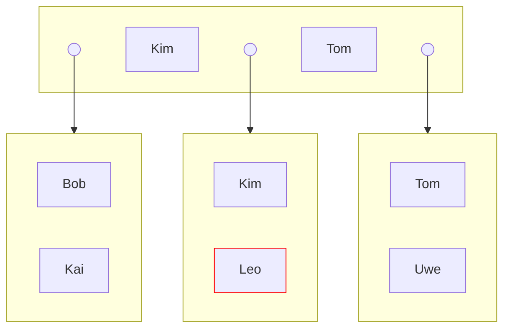
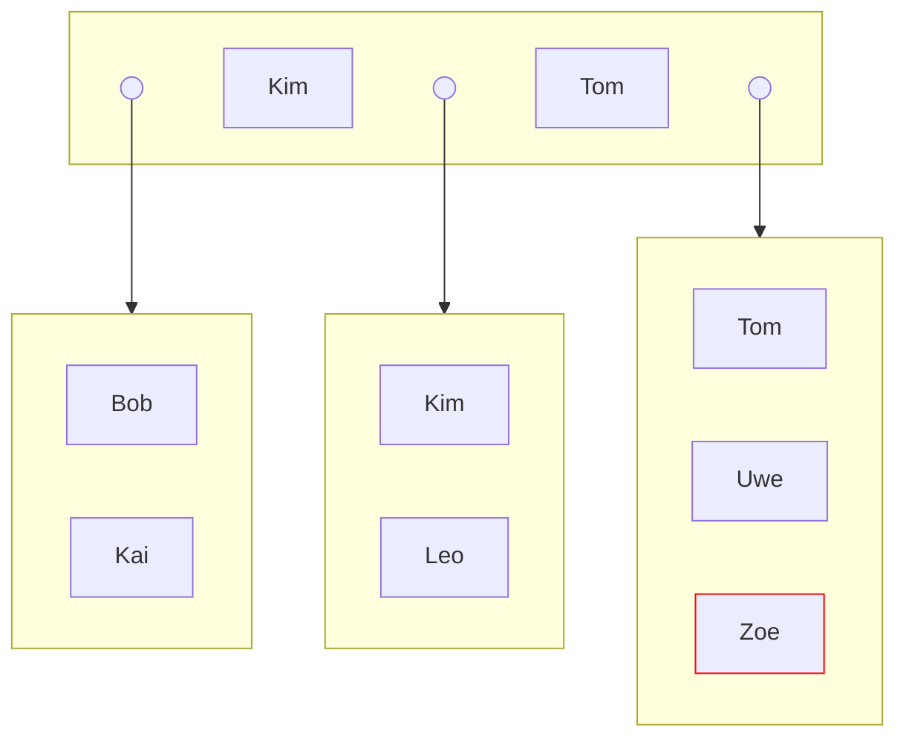

# Gegeben

- $k=k^*=1$



# Einfügen von Leo

Wo soll Leo hin?

```
ABCDEFGHIJKLMNOPQRSTUVWXYZ
           ^
```

K < L < T --> Leo muss in das mittlere Blatt, rechts von Kim. Weil es hier noch platz gibt, einfach einfügen.



# Einfügen von Zoe

Wo soll Zoe hin? T < U < Z --> Zoe muss in das rechte Blatt, rechts von Uwe.



Jetzt ist die Anzahl der Einträge im rechten Blatt 3. Die maximale Anzahl an Einträgen in einem Blatt eines B+-Baums ist $2k^*$.