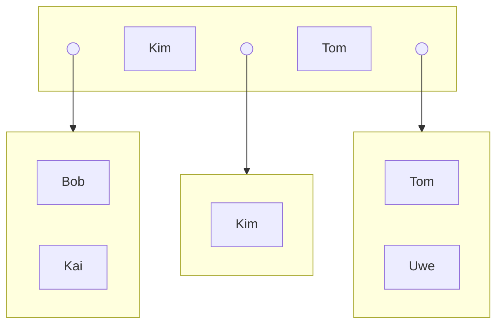
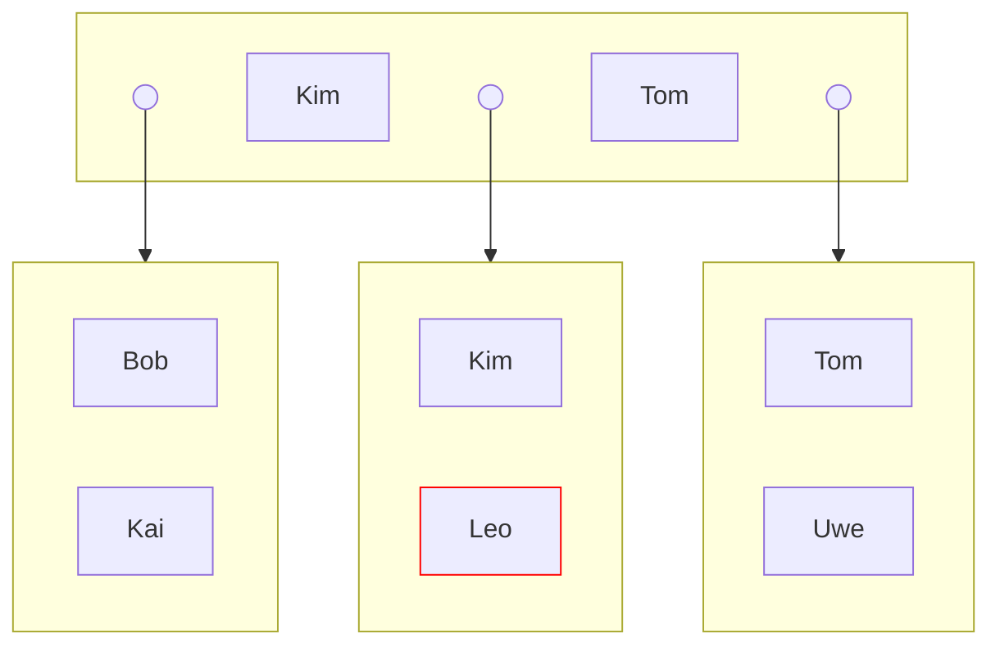
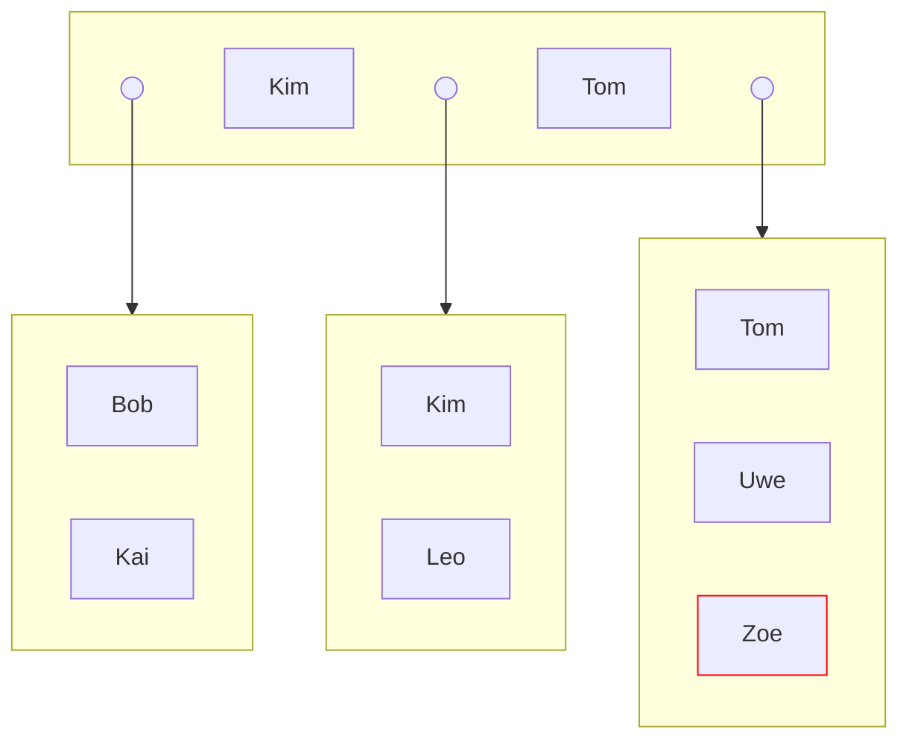
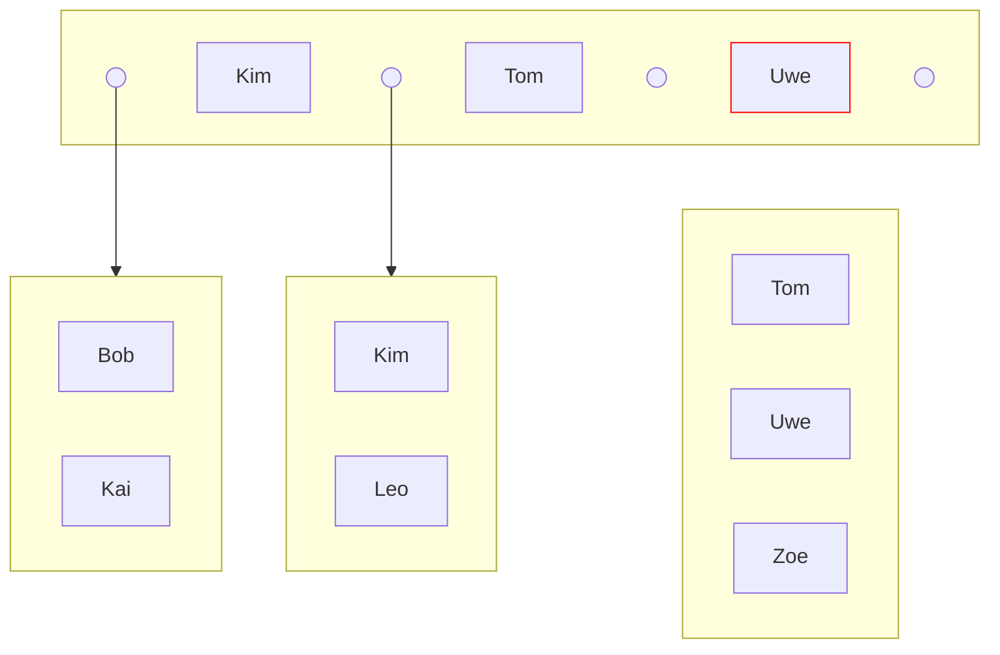
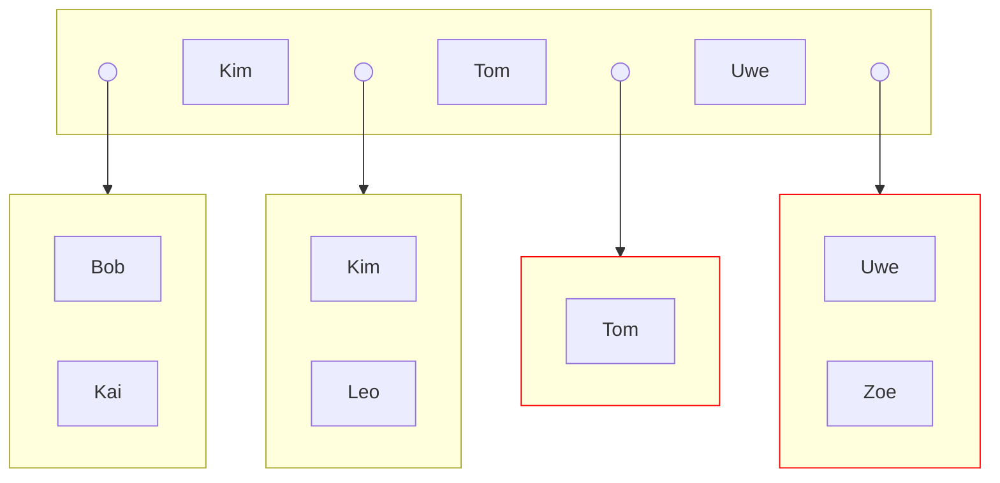
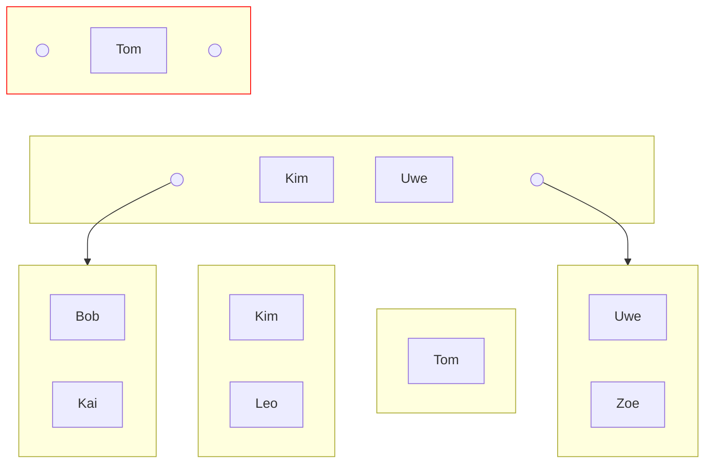
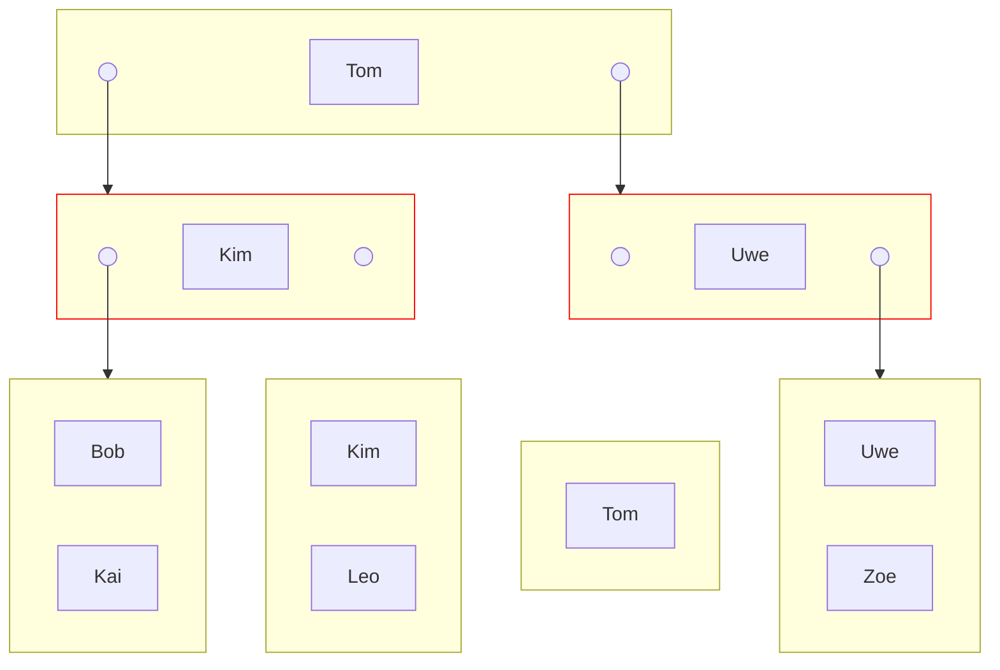
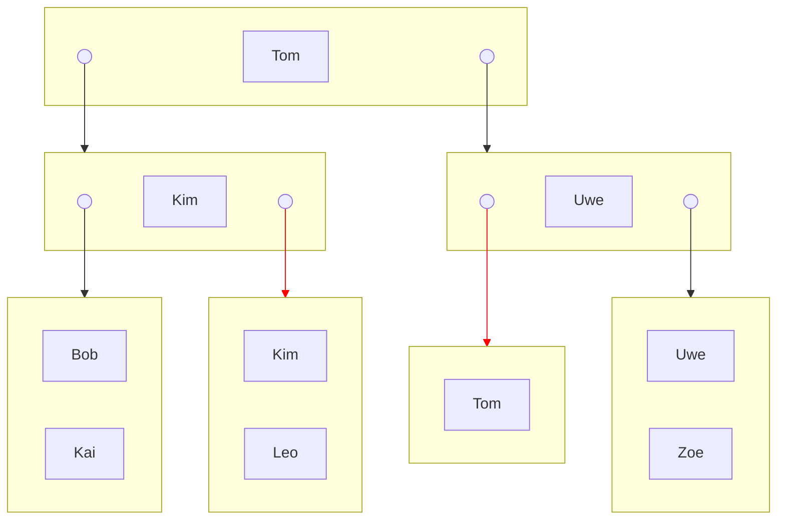

# Gegeben

- $k=k^*=1$



# Einfügen von Leo

Wo soll Leo hin?

```
ABCDEFGHIJKLMNOPQRSTUVWXYZ
           ^
```

K < L < T --> Leo muss in das mittlere Blatt, rechts von Kim. Weil es hier noch platz gibt, einfach einfügen.



# Einfügen von Zoe

Wo soll Zoe hin? T < U < Z --> Zoe muss in das rechte Blatt, rechts von Uwe.



Jetzt ist die Anzahl der Einträge im rechten Blatt 3. Die maximale Anzahl an Einträgen in einem Blatt sind aber 2 ($2k^*$). Es gibt also in diesem Blatt einen Überlauf, es muss also **gesplittet** werden. Zuerst wird der mittlere Eintrag (Uwe) in den Vaterknoten kopiert.



Das Blatt wird dann in ein linkes und ein rechtes Blatt gespalten.

| Links | Rechts |
| ---- | ---- |
| Einträge $<$ Uwe | Uwe $\le$ Einträge |
| Tom | Uwe, Zoe |



Jetzt ist die Anzahl der Einträge in der Wurzel 3. Die maximale Anzahl an Einträgen in einem inneren Knoten ist aber 2 ($2k$). Es gibt also in diesem Knoten einen Überlauf, es muss also **gesplittet** werden. Zuerst wird der mittlere Eintrag (Tom) in den Vaterknoten **verschoben**. Da es keinen Vaterknoten gibt, wird eine neue Wurzel erstellt.



Die alte Wurzel wird in einen linken und einen rechten inneren Knoten gespalten.

| Links | Rechts |
| ---- | ---- |
| Einträge $<$ Tom | Tom $<$ Einträge |
| Kim | Uwe |



Das Blatt, das ursprünglich zwischen Kim und Tom war, ist jetzt das rechte Kind von Kim. Das Blatt, das ursprünglich zwischen Tom und Uwe war, ist jetzt das linke Kind von Uwe.



# Prüfen

https://www.cs.usfca.edu/~galles/visualization/BPlusTree.html

Alles richtig.

# 20 Zahlen, k=k*=2, h=2

- $k = 2 \implies N=2k=4$ (N: Maximale Anzahl Einträge pro Knoten/Blatt)
- $\frac{20}{N+1} = 4 \implies$ Vielfache von 4
- 4 gleichmäßig verteilte Werte: 4, 8, 12, 16
- Wir wollen in der Wurzel diese Werte
- Füge für jeden dieser Werte zuerst 2 kleinere, dann 2 größere ein.
