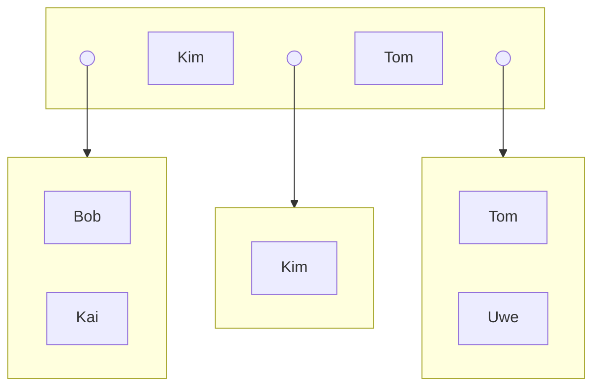
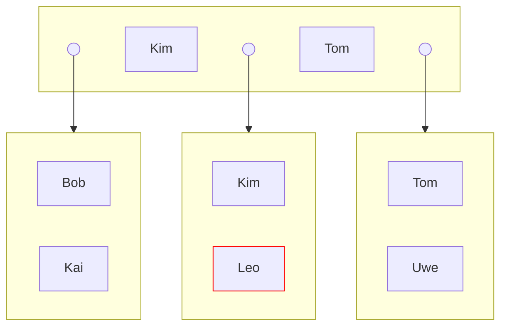
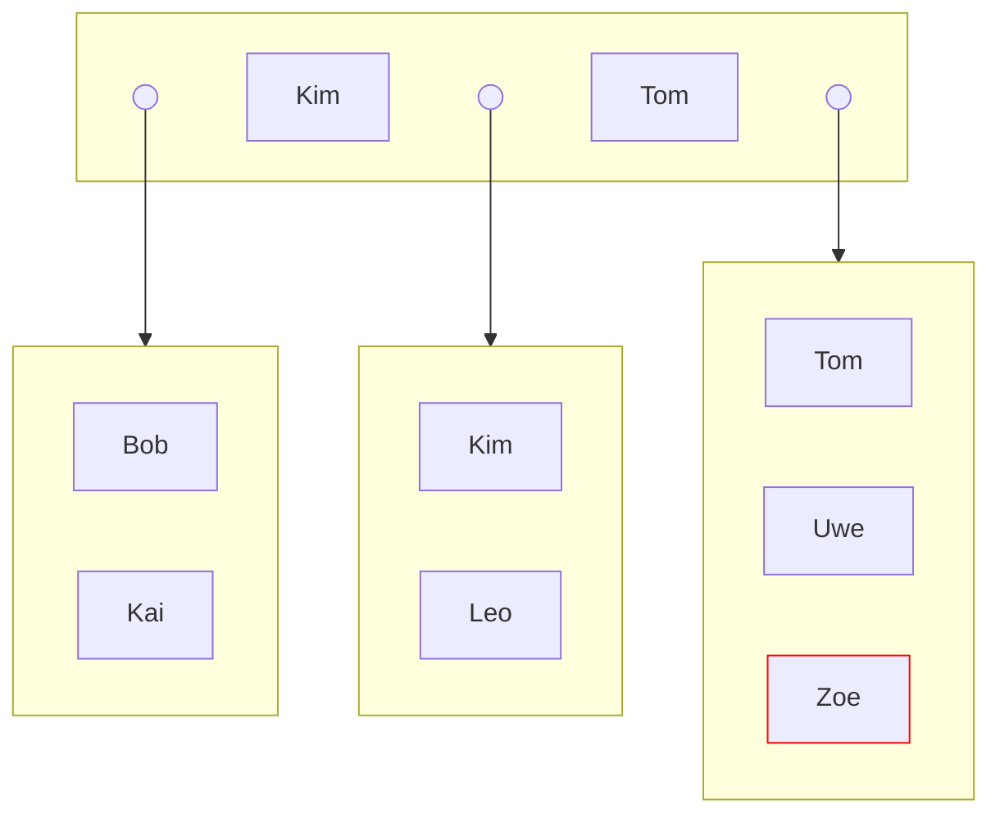
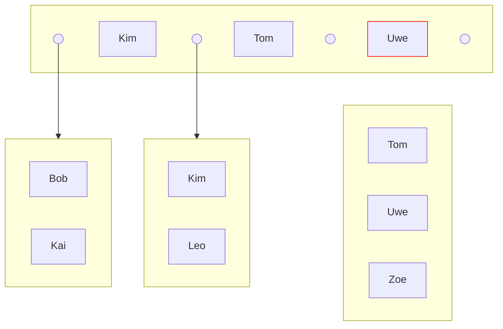
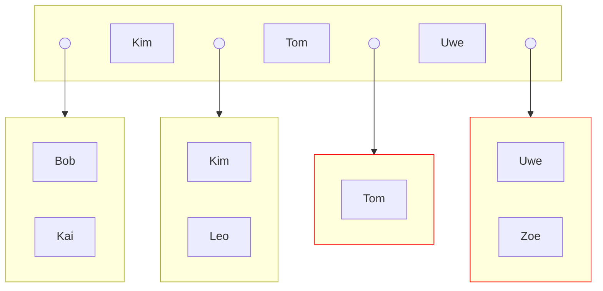
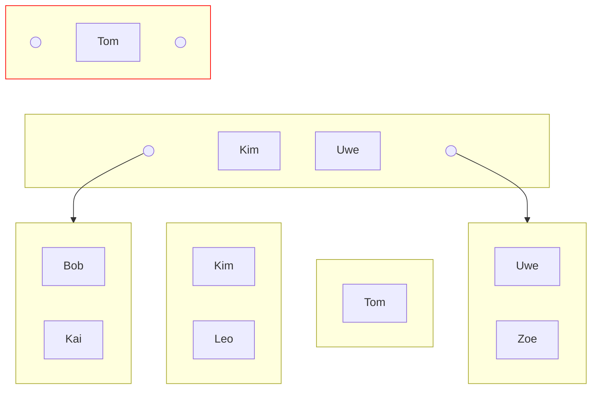
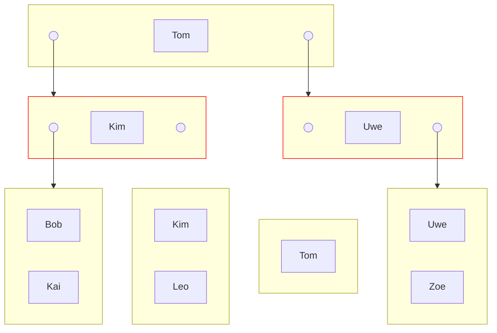
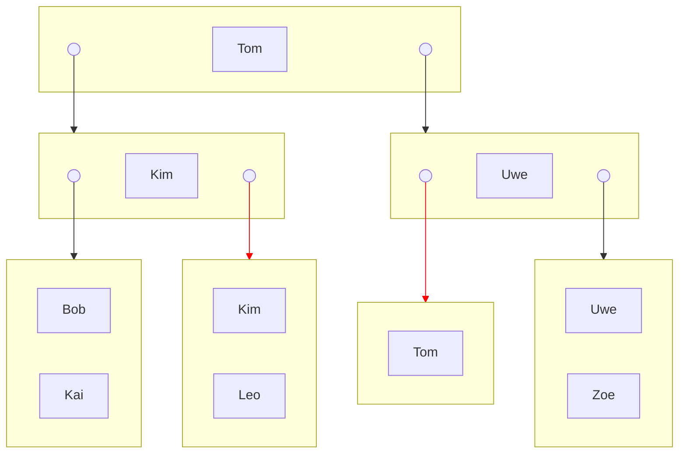

# Gegeben

- $k=k^*=1$



# Einfügen von Leo

Wo soll Leo hin?

```
ABCDEFGHIJKLMNOPQRSTUVWXYZ
           ^
```

K < L < T --> Leo muss in das mittlere Blatt, rechts von Kim. Weil es hier noch platz gibt, einfach einfügen.



# Einfügen von Zoe

Wo soll Zoe hin? T < U < Z --> Zoe muss in das rechte Blatt, rechts von Uwe.



Jetzt ist die Anzahl der Einträge im rechten Blatt 3. Die maximale Anzahl an Einträgen in einem Blatt sind aber 2 ($2k^*$). Es gibt also in diesem Blatt einen Überlauf, es muss also **gesplittet** werden. Zuerst wird der mittlere Eintrag (Uwe) in den Vaterknoten kopiert.



Das Blatt wird dann in ein linkes und ein rechtes Blatt gespalten.

| Links | Rechts |
| ---- | ---- |
| Einträge $<$ Uwe | Uwe $\le$ Einträge |
| Tom | Uwe, Zoe |



Jetzt ist die Anzahl der Einträge in der Wurzel 3. Die maximale Anzahl an Einträgen in einem inneren Knoten ist aber 2 ($2k$). Es gibt also in diesem Knoten einen Überlauf, es muss also **gesplittet** werden. Zuerst wird der mittlere Eintrag (Tom) in den Vaterknoten **verschoben**. Da es keinen Vaterknoten gibt, wird eine neue Wurzel erstellt.



Die alte Wurzel wird in einen linken und einen rechten inneren Knoten gespalten.

| Links | Rechts |
| ---- | ---- |
| Einträge $<$ Tom | Tom $<$ Einträge |
| Kim | Uwe |



Das Blatt, das ursprünglich zwischen Kim und Tom war, ist jetzt das rechte Kind von Kim. Das Blatt, das ursprünglich zwischen Tom und Uwe war, ist jetzt das linke Kind von Uwe.



# Prüfen

https://www.cs.usfca.edu/~galles/visualization/BPlusTree.html

Alles richtig.

# Einfügen mit geringer Höhe

Gegeben ist

- k=k*=2

Daraus folgt

- Max. Grad: 2k+1 = 5
- Max. Blätter (Kindknoten): 2k+1 = 5
- Knoten insgesamt: 5 + 1 = 6
- Max. Einträge pro Knoten/Blatt: 2k = 4
- Max. Einträge insgesamt: 6 *  4 = 28

Der Zielbaum

- Hat 20 verschiedene beliebige Zahlen
- Hat genau 5 Blätter à 4 Einträge
- Hat 1 Wurzel mit 4 Einträgen, die in den Blättern auch existieren

Das Einfügen verläuft generell folgendermaßen

- Nach 5x einfügen wird gespalten, und der mittlere Eintrag wird in die Wurzel kopiert.

Die Lösung ist

- Mit 5000 anfangen und Zahlen in 100er-Schritten nach oben und nach unten einfügen, um so oft zu splitten, dass 5 Blätter erzeugt werden.
- Die nicht-leeren Blätter mit beliebigen Zahlen auffüllen

![[b plus tree 1.png]]

Alternativ

- Die Zahlen sind 1, 2, ..., 20
- Teilt man diese in 5 Mengen à 4 Elemente auf, so sind diese
	- $B_1 = \{1, 2, 3, 4\}$
	- $B_2 = \{5, 6, 7, 8\}$
	- $B_3 = \{9, 10, 11, 12\}$
	- $B_4 = \{13, 14, 15, 16\}$
	- $B_5 = \{17, 18, 19, 20\}$
- Es gilt für die Elemente dieser Mengen:

$$
B_1 < 5 \le B_2 < 9 \le B_3 < 13 \le B_4 < 17 \le B_5
$$

- Die Wurzeleinträge müssen also $W = \{5, 9, 13, 17\}$ sein.
- Die Reihenfolge ist

| Teilreihenfolge | Erklärung |
| ---- | ---- |
| 1, 2 | $B_1$ starten |
| 5, 6 | - 5 in $W$<br>- $B_2$ starten |
| 9 | - 9 in $W$<br>- $B_3$ starten |
| 3, 4 | - $B_1$ füllen |
| 10 | - $B_3$ weiter füllen |
| 13 | - 13 in $W$<br>- $B_4$ starten |
| 7, 8 | - $B_2$ füllen |
| 14 | - $B_4$ weiter füllen |
| 17 | - 17 in $W$<br>- $B_5$ starten |
| 11, 12 | - $B_3$ füllen |
| 18, 19 | - $B_5$ weiter füllen |
| 15, 16 | - $B_4$ füllen |
| 20 | - $B_5$ füllen |

![[b plus tree 2.png]]
