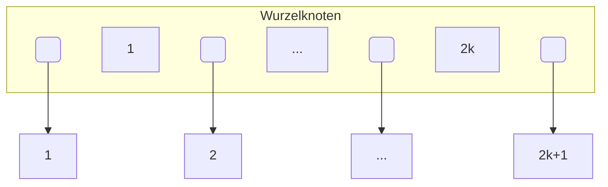

# B-Baum

- Selbst-balancierender Baum
- Daten stecken im ganzen Baum
- Sortierte Ausgabe: Links-Links-hoch-Rechts-Links-...
	- B+-Baum einfach Blätter nach rechts
- Jeder Knoten Max Grad 2k+1
	- Max 2k+1 Kindknoten
- Jeder Knoten hat zwischen k und 2k Einträge
	- (Wurzel nur mindestens 1 Eintrag)




- Kanten links kleiner, rechts größer
- Suche:

```
n = Gesuchter Schlüssel
k = Wurzelknoten

n < k: k = k.left_child
n > k: k = k.right_child
n = k: return k
```

- k wird folgendermaßen gewählt:
	- Pointer zum Kindknoten belegt l byte
	- Pointer zu Datensätzen belegen m byte
	- Wegweiser belegt n byte
	- Es gibt 2k knoten
	- $\text{Bytes} = (l+m+n) \cdot (2k)$
	- z.B. $l=4, m=4, n=20, k=50$
		- $100 \cdot (4+20+4)+4=2404\text{B}$
		- k richtet sich danach, ob die Bytes in eine Page passt
		- keine Ahnung woher +4 kommt
- Insert und Delete bei B-Bäumen behandeln wir nicht

# B+-Baum

- Innere Knoten: Nicht-Blatt-Knoten
- Blatt-Knoten: Ganz unten
- Alle Daten sind auf Blattebene
- $k \le N \le 2k$ (N: Anzahl Einträge in einem inneren Knoten)
- $0 \le M \le 2k+1$ (M: Anzahl Kinderknoten eines inneren Knotens)
- $k^* \le N_B \le 2k^*$ ($N_B$: Anzahl Einträge in einem Blattknoten)
- In Praxis: $k > k^*$
	- d.h. es passen mehr Einträge in innere Knoten als in Blattknoten
	- -> Geringere Höhe mit größerem k
	- -> Schlüsselkomprimierung
	- Blattknoten haben Pointer zu Seiten
- Blattknoten sind doppelt verkettet
- Postgres: Vacuum: Baum neu aufbauen
- Suche:
	- $n < k$: k = k.left_child
	- $n \ge k$: k= k.right_child
- Einfügen:
	- 1. Suche, in welchem Blatt der neue Schlüssel sein sollte
	- 2. Wenn Anzahl Einträge im Blatt kleiner als $2k^*$ ist, füge Eintrag dort ein
	- 3. Sonst (Überlauf), füge ein und **splitte**
		- a. Es sind nach Einfügen genau $2k^*+1$ Einträge im Blatt
		- b. Es gibt also genau einen Mittel-Eintrag. Dieser wird zum Vaterknoten **kopiert**.
		- c. Es gibt auch genau $k$ linke (kleiner) und $k+1$ rechte (größer gleich) Einträge. Die linken sind links vom neuen Vaterknoten-Eintrag, analog rechts.
		- d. Falls Anzahl Einträge im Vaterknoten nun $2k+1$, **splitte** Vaterknoten (Ab Schritt b). **Aber**: Split wie bei B-Baum, also es wird **nicht kopiert, sondern verschoben**. Kinder: Links echt kleiner, Rechts echt größer.
- Löschen:
	- 1. Suche, in welchem Blatt der zu löschende Knoten ist
	- 2. Wenn Anzahl Einträge im Blatt nach löschen $\ge k$, einfach löschen
	- 3. Sonst (Unterlauf):
		- a. Es sind genau $k^*-1$ Einträge im Blatt
		- b. Falls existiert Nachbarblatt mit mehr als $k^*$ Einträgen, **ausgleich**:
			- lösche Eintrag aus Blatt
			- Nehme 1 Eintrag aus Nachbarblatt in Blatt
			- Passe Wegweiser im Vaterknoten an
		- c. Sonst, **mische**:
			- Es sind genau $k^*-1$ Einträge im Blatt
			- Es sind genau $k^*$ Einträge im Nachbarblatt
			- Nach mischen sind $2k^*-1$ Einträge im Blatt
			- Wegweiser in Vaterknoten fällt weg
			- lösche Eintrag aus Blatt