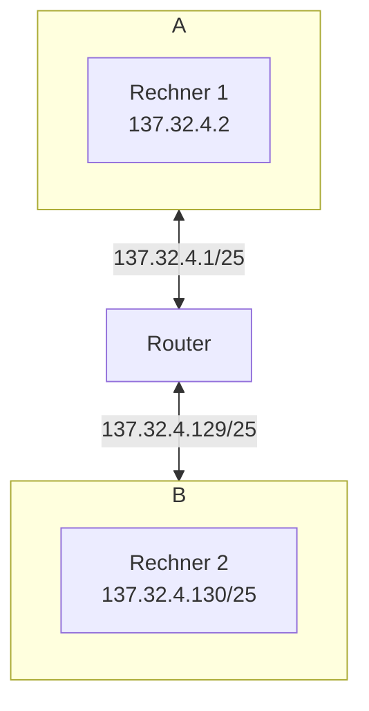

```
137.23.4.0/24
```

# Binär
```
10001111.00010111.00000100.00000000
^^^^^^^^ ^^^^^^^^ ^^^^^^^^ ********
Netz-ID                    Interface-ID
```

# Subnetze (bin)
```
10001111.00010111.00000100.00000000 (A)
10001111.00010111.00000100.10000000 (B)
						   ^
```
# Subnetze (dec)
```
137.32.4.0/25   (A)
137.32.4.128/25 (B)
```

# Mögliche Host-Adressen
```
137.32.4.2   - 137.32.4.127 (A)
137.32.4.130 - 137.32.4.254 (B)
```

# Broadcast-Adressen
```
137.32.4.127 (A)
137.32.4.255 (B)
```

# Netzwerk-Plan

