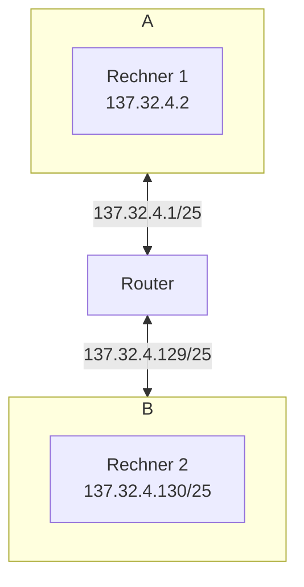

```
137.23.4.0/24
```

# Binär

```
10001111.00010111.00000100.00000000
^^^^^^^^ ^^^^^^^^ ^^^^^^^^ ********
Netz-ID                    Interface-ID
```

> [!fail] Falsche Umrechnung (erste 8 bits)
>
>```
>10001001 00010111 00000100 00000000
>^^^^^^^^ ^^^^^^^^ ^^^^^^^^
>```

# Subnetze (bin)

```
10001111.00010111.00000100.00000000 (A)
10001111.00010111.00000100.10000000 (B)
						   ^
```

> [!fail] Folgefehler (erste 8 bits)
>```
>10001001.00010111.00000100.00000000 (A)
>10001001.00010111.00000100.10000000 (B)
>						   ^
>```

# Subnetze (dec)

```
137.23.4.0/25   (A)
137.23.4.128/25 (B)
```

> [!check] Richtig

# Mögliche Host-Adressen

```
137.23.4.2   - 137.23.4.127 (A)
137.23.4.130 - 137.23.4.254 (B)
```

> [!fail] Falsch
>Router-IP ist teil der Adressraums. Netz-ID und Broadcast aber nicht.
>```
>137.23.4.1   - 137.23.4.126 (A)
>137.23.4.129 - 137.23.4.254 (B)
>```
>
>**A**
>- `...0`: Netz-ID
>- `...127`: Broadcast
>
>**B**
>- `...128`: Netz-ID
>- `...255`: Broadcast

# Broadcast-Adressen

```
137.23.4.127 (A)
137.23.4.255 (B)
```

> [!check] Richtig

# Netzwerk-Plan




> [!note] Netzwerk-Plan
> - 2 Hosts pro Netz: Min und Max Adr.
> - Subnetze über Switch
