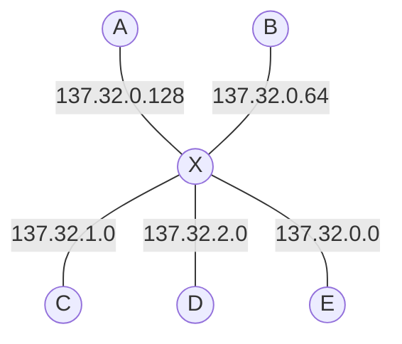

# Gegeben
## Zugewiesener Adressbereich
```
137.23.0.0/21
```

## Anzahl Rechner
|Abteilung|Rechner|
|-|-|
|A|100|
|B|50|
|C|100|
|D|300|
|E|1000|

# Bearbeitung
## Adressbereich in Binär
```
10001111.00010111.00000000.00000000
^^^^^^^^ ^^^^^^^^ ^^^^^
```


> [!fail] Falsche Umrechnung (erste 8 bits)
> 137 = `10001001`


## Subnetze
### A
$$
\begin{gather*}
	\left\lceil \log_2 100\right\rceil = 7 \\

	\implies \mathtt{
			\underbrace{
				10001111.00010111.00000
				\textcolor{red}{XXX}
				.
				\textcolor{red}{X}
			}_{
				\text{Netz-ID}
			}
			\underbrace{
				0000000
			}_\text{
				Host-ID
			}
		}
\end{gather*}
$$

### B
$$
\begin{gather*}
	\left\lceil \log_2 50\right\rceil = 6 \\

	\implies \mathtt{
			\underbrace{
				10001111.00010111.00000
				\textcolor{red}{XXX}
				.
				\textcolor{red}{XX}
			}_{
				\text{Netz-ID}
			}
			\underbrace{
				000000
			}_\text{
				Host-ID
			}
		}
\end{gather*}
$$


### C
$$
\begin{gather*}
	\left\lceil \log_2 100\right\rceil = 7 \\

	\implies \mathtt{
			\underbrace{
				10001111.00010111.00000
				\textcolor{red}{XXX}
				.
				\textcolor{red}{X}
			}_{
				\text{Netz-ID}
			}
			\underbrace{
				0000000
			}_\text{
				Host-ID
			}
		}
\end{gather*}
$$

### D
$$
\begin{gather*}
	\left\lceil \log_2 300\right\rceil = 9 \\
 
	\implies \mathtt{
			\underbrace{
				10001111.00010111.00000
				\textcolor{red}{XX}
			}_{
				\text{Netz-ID}
			}
			\underbrace{
				0.00000000
			}_\text{
				Host-ID
			}
		}
	\end{gather*}
$$

### E
$$
\begin{gather*}
	\left\lceil \log_2 1000 \right\rceil = 10 \\
 
	\implies \mathtt{
		\underbrace{
			10001111.00010111.00000
			\textcolor{red}{X}
		}_{
			\text{Netz-ID}
		}
		\underbrace{
			00.00000000
		}_\text{
			Host-ID
		}
	}
\end{gather*}
$$

> [!check] Richtig

> [!NOTE] Zusammenfassung
> $$
> \begin{align*}
> 	A&&\mathtt{
> 		10001111.00010111.00000
> 		\textcolor{red}{XXX}
> 		.\!
> 		\textcolor{red}{X}
> 		0000000
> 	} \\
> 
> 	B&&\mathtt{
> 		10001111.00010111.00000
> 		\textcolor{red}{XXX}
> 		.\!
> 		\textcolor{red}{XX}
> 		000000
> 	} \\
> 
> 	C&&\mathtt{
> 		10001111.00010111.00000
> 		\textcolor{red}{XXX}
> 		.\!
> 		\textcolor{red}{X}
> 		0000000
> 	} \\
> 
> 	D&&\mathtt{
> 		10001111.00010111.00000
> 		\textcolor{red}{XX}
> 		0.00000000
> 	} \\
> 
> 	E&&\mathtt{
> 		10001111.00010111.00000
> 		\textcolor{red}{X}
> 		00.00000000
> 	}
> \end{align*}
> $$

## Auswahl
$$
\begin{align*}
	A&&\mathtt{
		\textcolor{grey}{10001111.00010111.00000}
		\textcolor{red}{000}
		\textcolor{grey}{.}\!
		\textcolor{red}{1}
		\textcolor{grey}{0000000}
	} \\

	B&&\mathtt{
		\textcolor{grey}{10001111.00010111.00000}
		\textcolor{red}{000}
		\textcolor{grey}{.}\!
		\textcolor{red}{01}
		\textcolor{grey}{000000}
	} \\

	C&&\mathtt{
		\textcolor{grey}{10001111.00010111.00000}
		\textcolor{red}{001}
		\textcolor{grey}{.}\!
		\textcolor{red}{0}
		\textcolor{grey}{0000000}
	} \\

	D&&\mathtt{
		\textcolor{grey}{10001111.00010111.00000}
		\textcolor{red}{01}
		\textcolor{grey}{0.00000000}
	} \\

	E&&\mathtt{
		\textcolor{grey}{10001111.00010111.00000}
		\textcolor{red}{0}
		\textcolor{grey}{00.00000000}
	}
\end{align*}
$$


> [!fail] Überlappende Präfixe
>
>$$
>\begin{align*}
>	A&&\mathtt{
>		\textcolor{grey}{10001111.00010111.00000}
>		\textcolor{red}{111}
>		\textcolor{grey}{.}\!
>		\textcolor{red}{1}
>		\textcolor{grey}{0000000}
>	} \\
>
>	B&&\mathtt{
>		\textcolor{grey}{10001111.00010111.00000}
>		\textcolor{red}{111}
>		\textcolor{grey}{.}\!
>		\textcolor{red}{00}
>		\textcolor{grey}{000000}
>	} \\
>
>	C&&\mathtt{
>		\textcolor{grey}{10001111.00010111.00000}
>		\textcolor{red}{110}
>		\textcolor{grey}{.}\!
>		\textcolor{red}{0}
>		\textcolor{grey}{0000000}
>	} \\
>
>	D&&\mathtt{
>		\textcolor{grey}{10001111.00010111.00000}
>		\textcolor{red}{10}
>		\textcolor{grey}{0.00000000}
>	} \\
>
>	E&&\mathtt{
>		\textcolor{grey}{10001111.00010111.00000}
>		\textcolor{red}{0}
>		\textcolor{grey}{00.00000000}
>	}
>\end{align*}
>$$

# Antwort
|Subnetz|Netz-ID|Interface-IDs|Broadcast|
|-|-|-|-|
|A|137.32.0.128/25|137.32.0.129 - 137.32.0.254|137.32.0.255|
|B|137.32.0.64/26|137.32.0.65 - 137.32.0.126|137.32.0.127|
|C|137.32.1.0/25|137.32.1.1 - 137.32.1.126|137.32.1.127|
|D|137.32.2.0/23|137.32.2.1 - 137.32.3.254|137.32.3.255|
|E|137.32.0.0/22|137.32.0.1 - 137.32.3.254|137.32.3.255|

> [!check] Subnetzmasken richtig

# Netzwerk-Plan


> [!note] Lösung
> 
|Abteilung|Netzwerkadresse|Host-Adressen|Router-Adresse|Broadcast- Adresse|
|-|-|-|-|-|
|A|137.23.6.128/25|137.23.6.130 - 137.23.6.254|137.23.6.129|137.23.6.255|
|B|137.23.7.0/26|137.23.7.2 - 137.23.7.62|137.23.7.1|137.23.7.63|
|C|137.23.6.0/25|137.23.6.2 - 137.23.6.126|137.23.6.1|137.23.6.127|
|D|137.23.4.0/23|137.23.4.2 - 137.23.5.254|137.23.4.1|137.23.5.255|
|E|137.23.0.0/22|137.23.0.2 - 137.23.3.254|137.23.0.1|137.23.3.255|
