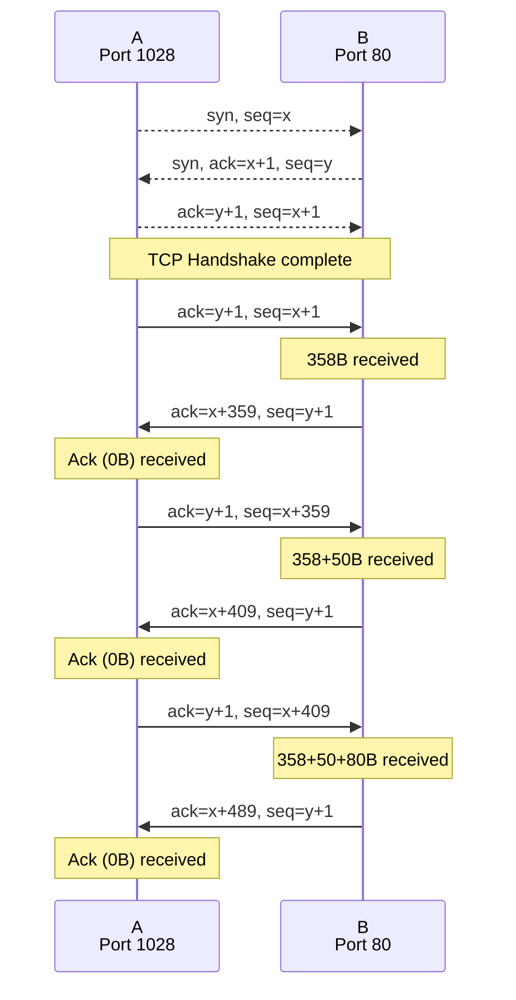

# Gegeben

## Kommunikation

- A$\to$(Bytes 0-358)$\to$B
- A$\to$(Segment 1 50B)$\to$B
- A$\to$(Segment 2 80B)$\to$B

## Hosts

|  | Type | Port |
| ---- | ---- | ---- |
| A | src | 1028 |
| B | dst | 80 |

## Segmente

|  | Größe | Byte-Nr |
| ---- | ---- | ---- |
| 1 | 50B | 359 |
| 2 | 80B | ? |

# Sequenzdiagramm

# Antworten

## a

- Ursprungsport: 1028
- Zielport: 80
- Sequenznummer: x+409

## b

- Ursprungsport: 80
- Zielport: 1028
- Ack: x+409
- Seq: y+1

## c

- Ack: x+489

## d

![[seq diagram.png]]

Letztes Ack fehlt!
